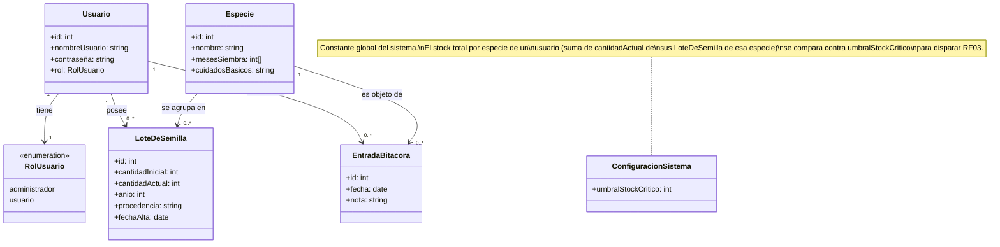

# Asistente de Jardinería

**Integrantes**
* Camila Durand
* Lucia Garcia Bode
* Milagros Morello Deppeler

###Descripcion General
El **Asistente de Jardinería** es un software orientado al uso movil diseñado para Técnicos y estudiantes en Jardineria de la UNER, agrónomos y público general. La plataforma centraliza la gestion de ficas botanicas, automatiza el control predictivo de stock de semillas y proporciona una bitácora personal de campo para documentar el desarrollo de cultivos mediante notas.

Para consultar la documentación técnica completa, diagramas de contexto, dominio y casos de uso, dirigire a la [Especificacioón de Requerimientos de Softwre (SRS)](docs/requirements/srs.md)

###Ciclo de Vida del Software
Se ha seleccionado un **Ciclo de Vida Iterativo Incremental**, debido a que los requerimientos de dominio no se encuentran completamente cerrados y pueden evolucionar con la interacción del usuario, este modelo permite validar tempranamente el Producto Minimo Viable (MVP) basado en el inventario de semillas y la bitácora persona, incorporando funciones complejas e integraciones externas en interaciones posteriores.

###Fuentes de descubrimiento
* Dominio y problema: asistente personal para el control de huerta, semillas y/o jardinería. Los técnicos y jardineros son quienes administran esto lo hacen en cuaderno o papel.
* Datos: datos textuales y observaciones que provienen de la práctica y de bibliografía.
* Usuarios y stakeholders: técnico jardinero, agrónomos, usuario general, administrador.
* Alcance realista: información de flora, stock de semillas, bitácora personal.
* Valor: posibilidad de maximizar lo estudiado y observado, teniéndolo todo en un solo soporte.

###Stakeholders y roles

####Stakeholders
1. Ingenieros agrónomos
2. Técnicos en jardinería
3. Público general con conocimiento en jardinería

####Roles del sistema:
1. Administrador
2. Usuario

## Modelo de dominio

Diagrama de clases de dominio derivado de los RF y de la decisión de uso personal: equematiza qué entidades existen, sus atributos y cómo se relacionan, no cómo se implementan.

### Diccionario de clases

| Clase | Descripción | RF/CU que la originan |
|---|---|---|
| `Usuario` | Cuenta con la que se accede al sistema. | RF00, CU00 |
| `RolUsuario` | Enumeración de los dos roles del sistema (administrador / usuario). | Sección "Stakeholders y roles" |
| `Especie` | Ficha de especie: catálogo de referencia, **compartido** entre todos los usuarios, no depende de quién lo cargó. | RF08 |
| `LoteDeSemilla` | Un lote de semillas de una especie, con su cantidad, año y origen. **Privado**: pertenece a un único `Usuario`. | RF01, RF02, RF03, CU01 |
| `EntradaBitacora` | Una observación de campo asociada a una especie. **Privada**: pertenece a un único `Usuario` (autor). | RF05, RF06, CU02 |
| `ConfiguracionSistema` | Valor constante y global del umbral de stock crítico; no varía por especie ni por usuario en TP1. | RF03 |

### Decisiones de modelado (y qué se dejó afuera a propósito)

- **No se modelan `Agrónomo`, `TécnicoJardinero` ni `PúblicoGeneral` como subclases de `Usuario`.** Son perfiles de stakeholder (contexto de dominio), pero desde que CU01 quedó sin restricción por perfil profesional, ninguno de los tres dispara un comportamiento distinto en el sistema: modelarlos como clases separadas sería agregar estructura que ningún RF usa.
- **`RolUsuario` se modela como enumeración de `Usuario`, no como una clase con relaciones propias**, porque RF00b (permisos diferenciados por rol) está diferido: hoy el rol es un dato descriptivo, no un objeto con comportamiento.
- **No hay una clase para "Visualización" ni "Panel".** CU03 no introduce una entidad de dominio nueva: solo lee y agrega datos que ya existen en `LoteDeSemilla` y `EntradaBitacora`. Es una vista/reporte, no un concepto de negocio persistente.
- **El "stock total por especie" no es un atributo guardado**, es un valor derivado: suma de `cantidadActual` de los `LoteDeSemilla` de esa especie que pertenecen al usuario. Se recalcula para RF03 y RF11, no se almacena aparte, para evitar inconsistencias entre el valor guardado y la suma real de lotes.

