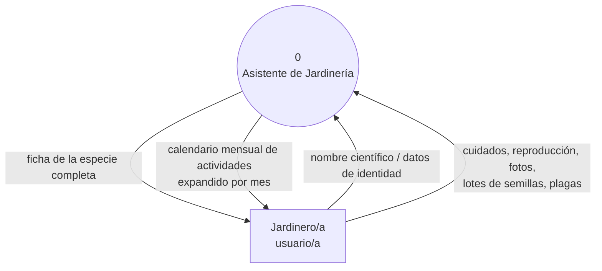

# Plantilla TP1 — Asistente de Jardinería

## Cómo usar esta plantilla

Esta plantilla sigue el orden exacto de la guía del TP1 (`tp1requerimientos.md`). Se armó en tres pasadas: (1) chat de WhatsApp de la clienta, (2) planilla Excel que ya usa, (3) entrevista para resolver las contradicciones entre las dos anteriores. No reemplaza al SRS ni al README — es el borrador de trabajo del grupo antes de pasar cada sección a `docs/requirements/srs.md` y al `README.md`.

Convenciones:

- ✅ **Resuelto (entrevista)** — la clienta lo confirmó explícitamente el 17/08. Ya es una decisión, no un borrador.
- ✅ **Borrador (chat/planilla)** — surge del chat o de la planilla pero no se confirmó todavía en la entrevista.
- 🔲 **A completar en grupo** — decisión de diseño que el grupo tiene que tomar (no la clienta).
- ❓ **Pregunta para la clienta** — quedó abierta después de esta entrevista.

---

## 0. Datos del grupo

| Campo | Valor |
|---|---|
| Integrantes |  Bode García Lucía, Durand Camila Ayelén, Morello Deppeler Milagros |
| Repositorio (URL) | [URL](https://github.com/Camila20197/Asistente-Jardiner-a-Inegenieria-Software-2026) |
| Nombre tentativo del sistema | Asistente de Jardinería |
| Fecha de este borrador | 2026-08-17 |

---

## 1. Resultados de la entrevista (17/08/2026)

Tabla de trazabilidad: qué se preguntó → qué contestó la clienta → qué decisión de diseño se toma a partir de eso. Esto es evidencia directa que pueden citar en la Instancia 1 cuando les pregunten "¿por qué esta historia de usuario y no otra?".

| # | Tema | Respuesta de la clienta (síntesis) | Decisión de diseño |
|---|---|---|---|
| 1 | Orden de carga de datos | Primero carga identidad (nombre, familia, origen, fecha); los cuidados los va completando a medida que consigue la información | Los campos de cuidado **no son obligatorios** al crear una especie. El alta es incremental, no todo-o-nada. |
| 2 | Origen del conocimiento de cuidados | Lo investiga, lo saca de internet, y lo aprende trabajando con la planta | No es un requerimiento del sistema — es contexto. No agregar un campo "fuente" salvo que el grupo decida que aporta valor. |
| 3 | Frecuencia y contexto de uso | Lo consulta **muy seguido**, en el celular, en el momento de trabajar con la planta (en el jardín) | Requisito de calidad: uso mobile-first y consulta rápida. Abre la pregunta de uso offline (ver preguntas nuevas, abajo). |
| 4 | Cuidados del frío / Trasplante | Son importantes; están vacíos solo porque todavía no encontró información, no porque sobren | Se confirman como atributos válidos de `Especie`, opcionales por instancia. |
| 5 | Reproducción sexual vs. asexual | Deben ir en **dos campos separados**. La asexual (injerto, esqueje, división, acodo) se unifica en **un solo campo de texto**, porque cada especie usa como mucho uno o dos métodos | `Especie.reproduccion_sexual` (texto) y `Especie.reproduccion_asexual` (texto libre, puede combinar métodos) — no una columna por método. |
| 6 | Tratamientos pregerminativos | Es un dato muy importante — quizás el más importante — y necesita **su propio momento en el calendario**, antes de la fecha de siembra | Es una actividad más del calendario (con su propio rango de meses), igual que siembra, poda o fertilización — no un campo de texto suelto. |
| 7 | Fotos | Muy importantes; **varias por especie**: planta completa (porte/hábito), hoja, flor, fruto, semilla; opcionalmente en dos etapas o estaciones. Hoy están sueltas en carpetas de la PC | Entidad `Foto` con atributo `tipo` (planta completa / hoja / flor / fruto / semilla) y multiplicidad N por especie. |
| 8 | Existencia / stock | No es un conteo (semillas muy chicas, difíciles de contar). Es: ¿hay o no hay en stock? + si hay, año y lugar de recolección. Puede haber **más de un registro por especie** (recolecciones de años distintos) | No es un campo simple: es una entidad propia (`LoteDeSemillas`: en_stock, año, procedencia), 1 especie → N lotes. |
| 9 | Plagas y enfermedades | Prefiere **texto libre por especie**, no un catálogo reutilizable: nombre de la plaga/enfermedad + tratamientos ordenados de más suave (biológico, ej. trichoderma) a más fuerte (químico) | `Especie` tiene N problemas fitosanitarios, cada uno con nombre + tratamientos. Decisión explícita: **no** normalizar plagas en un catálogo compartido entre especies. |
| 10 | Formato de fecha de compra/recolección | Mínimo el año; idealmente mes + año; a veces dos años porque hubo recolecciones en años consecutivos | Confirma el punto 8 (multiplicidad de lotes). Formato: mes opcional + año obligatorio. |
| 11 | Formato del nombre científico | Género y epíteto en cursiva; autor en texto normal; variedad entre comillas simples | Regla de presentación/validación del dato — no alcanza con guardar texto plano, hay que decidir cómo se muestra con ese formato. |
| 12 | Volumen esperado | Cientos de especies, muchas familias distintas — las 8 cargadas hoy son solo un ejemplo de una familia (Lamiaceae) | Confirma la escala para "alcance realista" y para los atributos de calidad de rendimiento/escalabilidad. |
| 13 | Calendario mensual | Cada actividad tiene un **rango de meses** (ej. siembra jul-ago-sep, poda mar-abr). Al consultar un mes, tienen que listarse **todas** las especies con alguna actividad ese mes (siembra, tratamiento pregerminativo, reproducción asexual, poda, etc.) | Confirma el diseño de "Actividad" como entidad con mes_inicio/mes_fin. La consulta "listame junio" tiene que expandir los rangos y agrupar por tipo de actividad, no solo por especie. |

### ⚠️ La pregunta más importante que dejó abierta la entrevista

La clienta habló todo el tiempo de **especie/variedad** (la albahaca canela, la albahaca limón) y de **lotes de semillas**, nunca de una planta individual que posee ("mi albahaca del macetero 3"). El chat original pedía "existencia de **plantas** y semillas", pero la entrevista solo aclaró el stock de semillas. Esto cambia el modelo de dominio: **puede que no haga falta una entidad `Planta` separada de `Especie`** — a confirmar antes de cerrar el modelo de dominio de la Semana 4 (ver secc. 5).

---

## 2. Modelo de ciclo de vida (secc. 3.1 del TP1)

| Pregunta guía | Respuesta del grupo |
|---|---|
| ¿Qué tan claros están los requerimientos hoy? | ✅ Después de la entrevista, bastante más claros que al principio: quedaron resueltas 11 de las 13 ambigüedades detectadas entre el chat y la planilla. Sigue habiendo puntos de diseño sin cerrar (ver preguntas nuevas). |
| ¿Hay un núcleo mínimo de valor entregable temprano? | 🔲 |
| ¿Qué riesgo puntual conviene gestionar con iteraciones cortas? | 🔲 (pista: cada entrevista siguió agregando detalle y cambiando decisiones ya tomadas — ver "Riesgos de fracaso" abajo) |
| ¿Van a usar alguna práctica ágil concreta (sprints, tablero, standup)? ¿Cuál y por qué? | 🔲 |

**Modelo elegido:** 🔲

**Justificación (3-5 líneas, citando ≥2 atributos propios del proyecto):**

🔲

---

## 3. Canvas de descubrimiento (secc. 4.2)

### Dominio y problema

✅ **Resuelto (entrevista):** hoy la clienta resuelve esto con la planilla Excel (que consulta con mucha frecuencia desde el celular mientras trabaja con la planta) más carpetas de fotos separadas en la PC, sin conexión entre ambas. El problema central no es la falta de datos — es que los datos de cuidado, las fotos y el calendario de tareas están **dispersos y desconectados entre sí**, y las fotos ni siquiera están junto al registro.

### Datos

✅ **Resuelto (entrevista) — por cada especie:**

- Nombre científico (con reglas de formato: género+epíteto en cursiva, autor en texto normal, variedad entre comillas simples)
- Nombre común, familia
- Riego, iluminación, fertilización, cuidados del frío, trasplante, podas (todos opcionales por instancia — se completan con el tiempo)
- Reproducción sexual (campo propio) y reproducción asexual (campo único, texto libre)
- Tratamientos pregerminativos, con su propio rango de meses en el calendario
- Fecha de siembra (rango de meses)
- Fotos múltiples por tipo: planta completa, hoja, flor, fruto, semilla (opcionalmente por etapa/estación)
- Lotes de semillas en stock: sí/no + año + procedencia (puede haber varios por especie)
- Problemas fitosanitarios: nombre de la plaga/enfermedad + tratamientos (de biológico a químico), texto libre por especie

🔲 **A completar en grupo:** ¿"Origen" (dónde se compró/recolectó la planta en sí, no la semilla) sigue siendo un campo separado, o se fusiona con la procedencia del lote de semillas?

### Usuarios y stakeholders

✅ **Resuelto (parcial):** el uso descripto en la entrevista es siempre en primera persona ("yo cargo", "yo consulto") — no hay evidencia todavía de un segundo perfil de usuario.

❓ **Pregunta para la clienta (ver lista al final):** ¿además de vos, alguien más usa o va a usar este registro?

### Valor

✅ **Resuelto (entrevista):** si el sistema funciona, la clienta deja de tener la información de cuidado separada de las fotos y de tener que decidir "a mano" qué hacer cada mes — puede abrir una sola cosa en el celular, en el momento en que está parada frente a la planta, y encontrar identidad + cuidados + fotos + calendario juntos.

### Alcance realista

✅ **Candidatos confirmados por la entrevista** (mínimo que ya demuestra el valor central):

- Ficha de especie con carga incremental (identidad primero, cuidados después)
- Reproducción sexual/asexual como campos separados
- Fotos múltiples por especie, clasificadas por tipo
- Lotes de semillas en stock (sí/no + año + procedencia)
- Problemas fitosanitarios en texto libre por especie
- Calendario mensual que expande rangos de meses y agrupa por tipo de actividad (siembra, tratamiento pregerminativo, poda, fertilización, reproducción asexual, trasplante)

🔲 **A completar en grupo — candidatos a dejar deliberadamente afuera de esta primera versión** (justificar por qué): por ejemplo, ¿el formato con cursiva del nombre científico es MVP o es un "nice to have" de presentación?

### Riesgos de fracaso (Módulo 1)

🔲 **A completar en grupo**, pero con evidencia nueva: en dos rondas de elicitación (chat → entrevista) varias decisiones cambiaron o se precisaron bastante (reproducción, plagas, stock, fotos). Esto es un indicio concreto de que **"cambio/evolución de requerimientos"** es un riesgo real y no solo teórico para este proyecto — decidan en grupo cómo lo van a gestionar (¿iteraciones cortas con validación frecuente de la clienta?).

### Datos sensibles

🔲 **A completar en grupo.** Sigue sin haber datos personales identificables de terceros. Punto nuevo a discutir: la "procedencia" de un lote de semillas ahora es un dato de ubicación geográfica concreto — si en algún caso viene de una recolección en un área protegida o de otra persona, ¿conviene guardar la ubicación en un nivel más general en vez de una dirección exacta? Déjenlo escrito aunque la respuesta sea "no aplica, por esto: ...".

---

## 4. Diagrama de contexto — DFD Nivel 0 (secc. 4.4)



🔲 A completar en grupo: revisar simbología exacta en `docs/instructivos/diagrama-de-contexto-dfd.md`. ¿Hay alguna entidad externa además del usuario?

---

## 5. Lista de stakeholders y usuarios

| Rol | ¿Usa el sistema? | Interés / necesidad | Fuente |
|---|---|---|---|
| Jardinero/a aficionado/a (la clienta) | Sí | Consultar identidad, cuidados, fotos y calendario en un solo lugar, desde el celular, en el momento de trabajar con la planta | ✅ entrevista |
| 🔲 | 🔲 | 🔲 | 🔲 |

---

## 6. Modelo de dominio — entidades candidatas (revisado post-entrevista)

⚠️ Antes de dibujar el diagrama ER de la Semana 4, resuelvan la pregunta abierta de la secc. 1 (¿existe `Planta` como instancia individual, o alcanza con `Especie` + `LoteDeSemillas`?).

- **Especie** — nombre_cientifico (con reglas de formato), nombre_comun, familia, riego, iluminacion, fertilizacion, cuidados_frio, trasplante, podas, reproduccion_sexual, reproduccion_asexual (todos los campos de cuidado son opcionales)
- **Foto** — tipo (planta completa / hoja / flor / fruto / semilla), etapa/estación (opcional) — N por Especie
- **LoteDeSemillas** — en_stock (booleano), año, procedencia — N por Especie
- **Actividad** (calendario) — tipo (siembra, tratamiento pregerminativo, poda, fertilización, trasplante, reproducción asexual), mes_inicio, mes_fin — N por Especie
- **ProblemaFitosanitario** — nombre (plaga o enfermedad), tratamientos (texto, de biológico a químico) — N por Especie

🔲 A completar en grupo: cardinalidades exactas, si `Actividad` conviene modelarla como una entidad única con `tipo` (como está arriba) o como varios atributos separados en `Especie`, y la pregunta de `Planta` vs. `Especie` de la secc. 1.

---

## 7. Historias de usuario (revisadas post-entrevista)

Formato: *Como \<rol\> quiero \<acción\> para \<objetivo\>*. Criterios en Given-When-Then.

**HU-01 — Buscar especie por nombre científico**
Como jardinero/a quiero buscar una especie por su nombre científico para ver su ficha completa.
Criterios de aceptación: 🔲

**HU-02 — Cargar una especie de forma incremental**
Como jardinero/a quiero poder guardar una especie solo con sus datos de identidad y completar los cuidados más adelante, para no tener que esperar a tener toda la información junta.
Criterios de aceptación: 🔲 *(dato clave de la entrevista, punto 1 — no estaba en la versión anterior de esta plantilla)*

**HU-03 — Ver fotos de identificación de una especie**
Como jardinero/a quiero ver varias fotos por especie, clasificadas por tipo (planta completa, hoja, flor, fruto, semilla), para identificarla correctamente.
Criterios de aceptación: 🔲

**HU-04 — Consultar el calendario mensual**
Como jardinero/a quiero, al elegir un mes, ver todas las especies que tienen alguna actividad ese mes (siembra, tratamiento pregerminativo, poda, fertilización, trasplante, reproducción asexual), agrupadas por tipo de actividad, para planificar mi trabajo.
Criterios de aceptación: 🔲

**HU-05 — Consultar problemas fitosanitarios**
Como jardinero/a quiero ver, para una especie, qué plagas o enfermedades la atacan y sus tratamientos ordenados de biológico a químico, para elegir la opción menos agresiva primero.
Criterios de aceptación: 🔲

**HU-06 — Consultar stock de semillas**
Como jardinero/a quiero ver si tengo semillas en stock de una especie y, si las tengo, el año y la procedencia de cada lote, para saber si necesito recolectar o comprar más.
Criterios de aceptación: 🔲

🔲 **Ojo con el alcance:** la entrevista dice que el tratamiento pregerminativo "necesita saberse con anticipación", pero **no pidió** una alerta o notificación — solo que aparezca a tiempo en el calendario. No conviertan eso en una HU de notificaciones push sin confirmarlo con la clienta; sería agregar alcance que nadie pidió.

🔲 A completar en grupo: revisar criterio INVEST en cada HU. ¿Falta alguna (por ejemplo, editar una ficha existente, dar de alta un nuevo lote de semillas)?

---

## 8. Atributos de calidad — ISO/IEC 25010 (revisado post-entrevista)

Escenario de calidad = fuente–estímulo–artefacto–entorno–respuesta–medida. Cubrir más de una condición de entorno por atributo.

| Atributo ISO 25010 | ¿Por qué aplica? | Escenario de calidad |
|---|---|---|
| Usabilidad | Se consulta muy seguido, desde el celular, parada frente a la planta — tiene que ser rápido de encontrar y leer | 🔲 |
| Compatibilidad / Portabilidad | Uso confirmado en celular, no en escritorio | 🔲 |
| Eficiencia de desempeño | Con "varios centenares" de especies y varias fotos por cada una, la búsqueda y el calendario tienen que seguir siendo rápidos | 🔲 |
| Precisión funcional | Un dato de riego/fertilización/plaga equivocado puede dañar una planta real | 🔲 |
| Mantenibilidad | El catálogo va a crecer en cantidad de especies y de familias con el tiempo | 🔲 |
| Disponibilidad / Fiabilidad | 🔲 depende de si hay conexión en el lugar donde trabaja — ver preguntas nuevas | 🔲 |

---

## 9. Preguntas nuevas que dejó abiertas esta entrevista

1. **La más importante:** ¿el sistema tiene que registrar cada planta individual que tenés (por ejemplo, "mi albahaca canela del macetero 3"), o alcanza con el nivel de especie/variedad + lotes de semillas en stock? Esto define si `Planta` es una entidad separada de `Especie`.
2. Cuando consultás el archivo en el celular mientras trabajás en el jardín, ¿tenés conexión a internet ahí, o el sistema necesita funcionar sin conexión?
3. Además de vos, ¿alguien más usa o va a usar este registro?
4. El tratamiento pregerminativo tiene que empezar antes de la fecha de siembra: ¿vos calculás ese mes a mano, o te serviría que el sistema lo sugiera a partir de la fecha de siembra?
5. Para el nombre científico con formato (cursiva, comillas para variedad): ¿es importante que se vea así en pantalla, o alcanza con guardarlo bien escrito?

---

## 10. Estructura del repositorio (secc. 6.1 — checklist)

- [ ] Repositorio creado en GitHub (uno por grupo)
- [ ] Todos los integrantes agregados como colaboradores
- [ ] Estructura de carpetas creada (`docs/requirements`, `docs/architecture`, `docs/ux`, `src`, `tests`)
- [ ] `README.md` inicial (nombre, integrantes, síntesis del canvas)
- [ ] `.gitignore` apropiado al stack
- [ ] Primer commit: `chore: estructura inicial del repositorio`

---

## 11. Artefactos a entregar (secc. 7 — checklist maestro del TP1)

- [ ] `README.md` liviano con síntesis (3-4 líneas) + link al SRS + modelo de ciclo de vida justificado
- [ ] Lista de stakeholders y usuarios con roles
- [ ] Diagrama de contexto DFD Nivel 0 en Mermaid
- [ ] Modelo de dominio inicial en Mermaid (ER o clases conceptual)
- [ ] Casos de uso (Cockburn) y/o historias de usuario con criterios de aceptación verificables — sin diagrama gráfico UML en el repo
- [ ] Atributos de calidad ISO 25010 con escenarios de calidad (fuente-estímulo-artefacto-entorno-respuesta-medida)
- [ ] SRS consolidado en `docs/requirements/`
- [ ] `docs/uso-ia.md` (ver secc. 12)
- [ ] Historial de commits real + tag `v1.0.0`

---

## 12. Bitácora de uso de IA — `docs/uso-ia.md` (borrador de dos entradas reales)

| Campo | Entrada 1 | Entrada 2 |
|---|---|---|
| Herramienta | Claude | Claude |
| Tarea puntual | Armar la plantilla inicial de TP1 a partir del chat de WhatsApp con la clienta | Analizar la planilla Excel real de la clienta, generar preguntas de entrevista, e incorporar las respuestas a la plantilla |
| Qué generó | Plantilla estructurada según las secciones del TP1, con borradores marcados para revisión | Comparación chat vs. planilla, lista de preguntas de entrevista, y actualización del modelo de dominio/HU/atributos de calidad con las respuestas |
| Qué se aceptó / modificó / descartó, y por qué | 🔲 | 🔲 |
| Errores o imprecisiones detectadas | 🔲 | 🔲 |

🔲 A completar en grupo: agreguen cada uso real de IA que hagan durante el TP.

---

## 13. Checklist final antes de presentar (secc. 10)

- [ ] Todos los `.md` commiteados en el repo (no en Google Docs/Word/Notion)
- [ ] Diagramas en bloques ```mermaid``` dentro de `.md`, no como imágenes
- [ ] SRS cubre requerimientos funcionales y atributos de calidad con sus escenarios
- [ ] Cada HU/CU tiene criterios de aceptación verificables
- [ ] `docs/uso-ia.md` actualizado
- [ ] Tag `v1.0.0` creado y publicado
- [ ] Todo el grupo puede explicar y defender cualquier decisión del documento, incluida por qué cambiaron de opinión entre el chat y la entrevista
