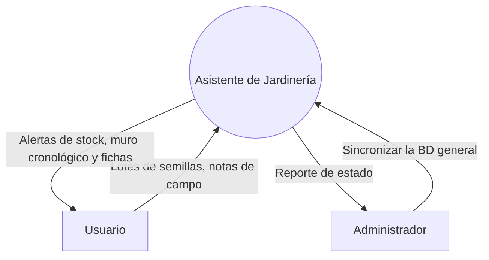
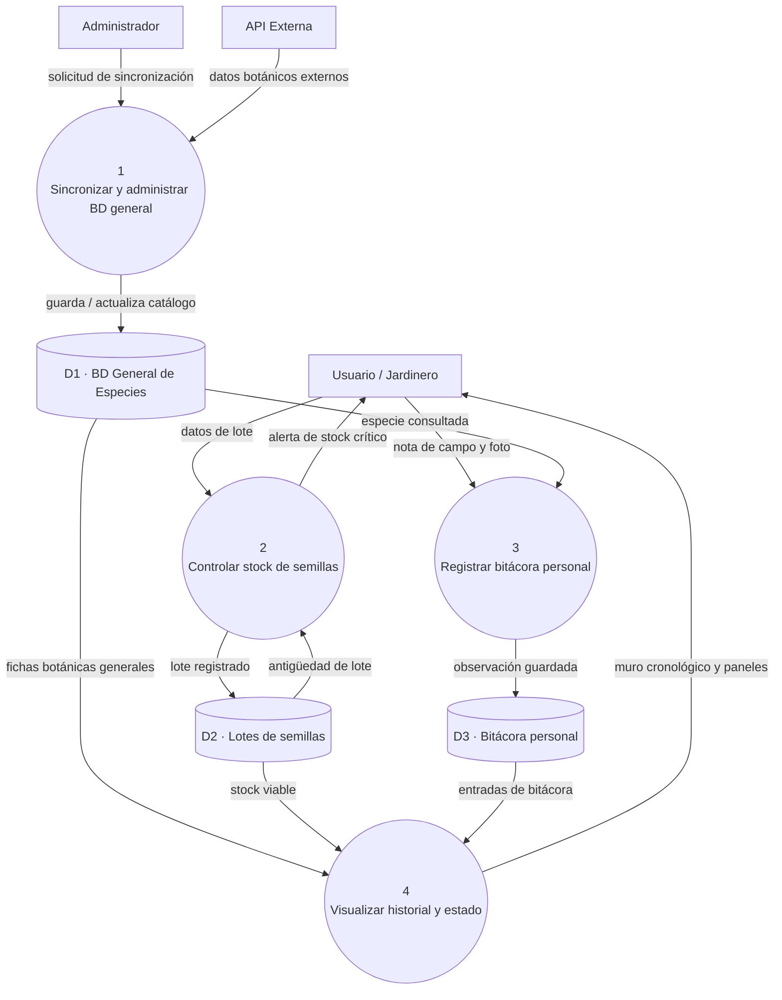
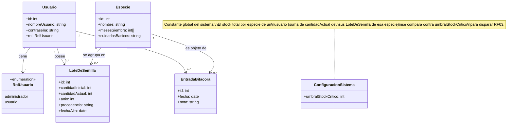

# Especificación de Requerimientos de Software (SRS)

## Proyecto: Asistente de Jardinería

## 1. Visión y alcance

### 1.1 Dominio y problema
En la jardinería, los cultivadores enfrentar desorganización en el seguimiento de sus cultivos o pérdida de insumos. Actualmente esto se resuelve de forma frangmentada mediante plantillas de cálculo, libretas de papel o la memoria, lo que puede provocar la pérdida de semillas por vencimiento y la falta de registros de técnicas que funcionaron en temporadas pasadas. 

### 1.2 Datos gestionados
* **Datos botánicos:** Fichas de especie, nombres científicos con reglas de formato (género en cursiva, variedad entre comillas simples), nombres comunes y familias.
* **Datos transaccionales de inventario:** Lotes de semillas, cantidades, mes y año de cosecha.
* **Bitácora:** Notas de campo en texto libre.

### 1.3 Usuarios y Stakeholders
**Stakeholders:**
1. Ingeniero Agrónomo
2. Técnicos en Jardineria
3. Público interesado

**Usuarios:**
* Roles:
1. Administrador
2. Usuario

#### Administrador

Rol interno del sistema, no un perfil del dominio. La entrevista con la clienta no
mostró un segundo perfil que administre el sistema, así que el administrador no tiene
funcionalidad propia en esta primera versión.
Se lo mantiene identificado porque el catálogo de especies es un dato de referencia
compartido y no personal: alguien tiene que responder por su consistencia. Sus
responsabilidades previstas son:
- Curar el catálogo compartido de especies: altas, correcciones y unificación de duplicados.
- Validar las fichas incorporadas desde fuentes externas (Flora Argentina, GBIF)
  antes de que queden disponibles para consulta.
- Dar de alta las cuentas de usuario.
Ninguna de las tres se desarrolla en este TP: se trabaja con dos cuentas precargadas
y el catálogo se carga manualmente. El administrador queda documentado a nivel de
alcance, sin casos de uso ni historias de usuario propias.

#### Usuario

Perfil del jardinero/a que lleva su propio registro botánico. Es el usuario final del
sistema y el destinatario del valor central del prototipo: hoy resuelve esto con una
planilla de cálculo que consulta desde el celular, más carpetas de fotos sueltas en la
PC, sin conexión entre ambas.
Trabaja mayormente desde el celular, en el jardín, en el momento de estar frente a
la planta. Sus tareas son:
- Cargar fichas de especie de forma incremental: primero la identidad (nombre
  científico, nombre común, familia) y los cuidados a medida que consigue la
  información.
- Asociar fotos a cada especie, clasificadas por tipo (planta completa, hoja, flor,
  fruto, semilla).
- Registrar los lotes de semillas que tiene en stock, con año y procedencia.
- Registrar notas de campo asociadas a una especie para documentar cómo evoluciona
  el cultivo.
- Consultar el calendario mensual para ver qué especies tienen alguna actividad ese
  mes: siembra, tratamiento pregerminativo, poda, fertilización, trasplante o
  reproducción asexual.
- Consultar la ficha completa de una especie mientras trabaja con ella.
Los lotes de semillas y las notas de campo pertenecen únicamente a la cuenta que los
cargó. El catálogo de especies, en cambio, es compartido (ver Administrador).

### 1.4 Propuesta de valor
Transforma la gestión empírica en un proceso guiado y predecible. Permite la consulta instantánea de semillas viables y consolida el historial del jardin en una visión cronologica accesible.

### 1.5 Selección justificada del alcance para el MVP
* **Procesos seleccionados para desarrollar**
1. Control de semillas: Permite controlar el inventario.
2. Gestión de bitácora y observaciones: Permite realizar un seguimiento de las especies elegidas, añadiendo controles pregerminativos, tipos, enfermedades y plagas, entre otros.
* **Procesos descartados para iteracciones futuras:**
1. *Sincronización con Google Calendar API* y *Alertas Climáticas con Estación Meteorológica*. Se posponen por depender de APIs de terceros. Aislar estos componentes permite consolidar la arquitectura de datos propia y reducir riesgos técnicos.

### 1.6 Riesgo de fracaso y mitigación
**Riesgo identificado (módulo 1):** *Incertidumbre inicial y cambio de requerimientos sobre la bitácora o gestor de semillas*
**Estrategia de mitigación:** Adopción del ciclo de vida Iterativo e Incremental para entregar un MVP funcional temprano, validando la usabilidad y reglas de negocio con el usuario antes de desarrollar módulos avanzados.

### 1.7 Datos sensibles y ética profesional (Código IEEE/ACM)
En cumplimiento con el Código de Ética IEEE/ACM sobre la protección de la privacidad, las notas de campo y ubicaciones de cultivo pertenecen exclusivamente al ámbito privado del usuario. Se aplica *privacidad por diseño*, manteniendo las bitácoras aisladas y desacopladas del catálogo base compartido.

## 2. Diagramas de Contexto (DFD)

### 2.1 DFD Nivel 0

### 2.2 DFD Nivel 1

## Modelo de dominio

Diagrama de clases de dominio derivado de los RF y de la decisión de uso personal: equematiza qué entidades existen, sus atributos y cómo se relacionan, no cómo se implementan.

### Diccionario de clases

| Clase | Descripción | RF/CU que la originan |
|---|---|---|
| `Usuario` | Cuenta con la que se accede al sistema. | RF00, CU00 |
| `RolUsuario` | Enumeración de los dos roles del sistema (administrador / usuario). | Sección "Stakeholders y roles" |
| `Especie` | Ficha de especie: catálogo de referencia, **compartido** entre todos los usuarios, no depende de quién lo cargó. | RF08 |
| `LoteDeSemilla` | Un lote de semillas de una especie, con su cantidad, año y origen. **Privado**: pertenece a un único `Usuario`. | RF01, RF02, RF03, CU01 |
| `EntradaBitacora` | Una observación de campo asociada a una especie. **Privada**: pertenece a un único `Usuario` (autor). | RF05, RF06, CU02 |
| `ConfiguracionSistema` | Valor constante y global del umbral de stock crítico; no varía por especie ni por usuario en TP1. | RF03 |

### Decisiones de modelado 

- **No se modelan `Agrónomo`, `TécnicoJardinero` ni `PúblicoGeneral` como subclases de `Usuario`.** Son perfiles de stakeholder (contexto de dominio), pero desde que CU01 quedó sin restricción por perfil profesional, ninguno de los tres dispara un comportamiento distinto en el sistema: modelarlos como clases separadas sería agregar estructura que ningún RF usa.
- **`RolUsuario` se modela como enumeración de `Usuario`, no como una clase con relaciones propias**, porque RF00b (permisos diferenciados por rol) está diferido: hoy el rol es un dato descriptivo, no un objeto con comportamiento.
- **No hay una clase para "Visualización" ni "Panel".** CU03 no introduce una entidad de dominio nueva: solo lee y agrega datos que ya existen en `LoteDeSemilla` y `EntradaBitacora`. Es una vista/reporte, no un concepto de negocio persistente.
- **El "stock total por especie" no es un atributo guardado**, es un valor derivado: suma de `cantidadActual` de los `LoteDeSemilla` de esa especie que pertenecen al usuario. Se recalcula para RF03 y RF11, no se almacena aparte, para evitar inconsistencias entre el valor guardado y la suma real de lotes.

## Elección de procesos a desarrollar

- Gestor de stock (semillas)
- Bitácora personal
- Visualización

Estos procesos conforman un núcleo de negocio propio, con lógica particular del proyecto, y no dependen de servicios externos, por lo que se pueden desarrollar, probar y validar en un entorno controlado.

## Requerimientos funcionales

Cada RF indica su prioridad para la línea base de TP1: **(obligatorio)** o **(opcional)**.

### Módulo 0 — Acceso

- **RF00 (obligatorio) — Autenticación:** el sistema debe permitir iniciar sesión con una de las dos cuentas precargadas (administrador / usuario), determinando el rol activo de la sesión.

### Módulo 1 — Gestión de Stock de Semillas

- **RF01 (obligatorio) — Registro y alta de lotes de semilla:** el sistema debe permitir registrar lotes de semillas existentes por especie, capturando cantidad inicial, año y origen, asociados al usuario que los registra (stock personal, no compartido).
- **RF02 (obligatorio) — Modificación y baja de lotes:** el sistema debe permitir actualizar el stock disponible de un lote, o darlo de baja si se agotó o descartó.
- **RF03 (opcional) — Alerta de stock crítico:** el sistema debe permitir definir un umbral mínimo de stock y emitir una alerta visible dentro de la aplicación cuando la cantidad disponible **de una especie (sumando todos sus lotes)** sea menor a dicho umbral. La alerta se evalúa a nivel de especie, no de lote individual, para evitar falsos negativos cuando el stock está repartido en varios lotes pequeños.
- **RF04 (obligatorio) — Consulta de semillas:** el sistema debe permitir filtrar el catálogo de semillas disponibles cuyo período de siembra (mes, de 1 a 12) sea el mes seleccionado.
- **RF08 (obligatorio) — Alta y consulta de ficha de especie:** el sistema debe permitir registrar una ficha de especie (nombre, período de siembra en meses, cuidados básicos), cargada manualmente, para poder asociarla a los lotes de semilla. El catálogo de especies es compartido entre todos los usuarios (no es un dato personal); solo los lotes de stock y las entradas de bitácora son privados por usuario.
- **RF09 (opcional) — Trazabilidad de movimientos de stock:** el sistema debe registrar qué usuario y en qué fecha/hora dio de alta, modificó o dio de baja un lote.

### Módulo 2 — Bitácora

- **RF05 (obligatorio) — Carga de notas y observación de campo:** el sistema debe permitir a cada usuario agregar notas y registros de evolución personal para cada ficha de especie, visibles únicamente para quien las creó.
- **RF06 (obligatorio) — Edición y eliminación de entradas:** el sistema debe permitir al usuario modificar o eliminar sus registros, parcial o completamente.

### Módulo 3 — Visualización

- **RF10 (obligatorio) — Historial de bitácora:** el sistema debe permitir visualizar, para una especie dada, la línea de tiempo de las entradas de bitácora registradas (fecha, autor, notas), ordenadas cronológicamente.
- **RF11 (obligatorio) — Panel de stock:** el sistema debe permitir visualizar un resumen del stock total de semillas por especie y por lote, destacando las especies por debajo del umbral crítico.
- **RF12 (obligatorio) — Filtros de visualización:** el sistema debe permitir filtrar la información visualizada por especie, por rango de fechas y/o por usuario que la cargó.

### Diferidos a un TP posterior

- **RF00b — Control de acceso por rol:** restringir funcionalidades específicas al rol administrador (ej. configuración de umbrales).
- **RF00c — Gestión de cuentas:** alta, baja y asignación de rol a cuentas de usuario (reemplazado en TP1 por las dos cuentas precargadas).

## Casos de uso

### CU00 (obligatorio): Iniciar sesión

- **Actor principal:** cualquier stakeholder con una de las dos cuentas precargadas.
- **Objetivo:** autenticarse para acceder a las funcionalidades habilitadas por su rol.
- **Realiza:** RF00.
- **Precondición:** existen las dos cuentas precargadas (administrador / usuario).

**Flujo principal**
1. El usuario ingresa usuario y contraseña.
2. El sistema valida las credenciales.
3. El sistema determina el rol de la cuenta (administrador / usuario).
4. El sistema redirige a la pantalla principal habilitando las funciones correspondientes al rol.

**Postcondición:** sesión iniciada; el rol determina las funcionalidades visibles/habilitadas.

**Flujos alternativos/excepción**
- A1: credenciales inválidas → el sistema muestra un mensaje de error y permite reintentar.

### CU01 (obligatorio): Gestión y predictibilidad de lotes de semillas

- **Actor principal:** usuario autenticado. Al ser un MVP de uso personal, no se restringe la carga de stock por perfil profesional: cualquier stakeholder autenticado (agrónomo, técnico o público general) puede operar sobre su propio stock.
- **Objetivo:** registrar un nuevo lote de semillas, consultar el stock existente y recibir alertas de stock crítico.
- **Realiza:** RF01, RF02, RF03 (si se incluye), RF04.
- **Precondición:** el usuario ha iniciado sesión (CU00) y existe al menos una especie registrada (RF08).

**Flujo principal**
1. El usuario selecciona una especie y accede a la sección "Lotes".
2. El sistema muestra los lotes existentes con su cantidad.
3. El usuario selecciona "Cargar nuevo Lote".
4. El usuario ingresa la cantidad inicial, año y procedencia.
5. Se confirma el registro.
6. El sistema muestra el nuevo lote en el listado.

**Postcondición:** el nuevo lote de semilla queda almacenado en el sistema y el stock total de la especie se actualiza.

**Flujos alternativos/excepción**
- A1: cantidad inicial menor o igual a cero → el sistema rechaza el alta y solicita corrección.
- A2: año de recolección mayor al actual → el sistema rechaza el alta y solicita corrección.
- A3: modificación o baja manual de lote.
- E1: stock total de la especie por debajo del umbral definido → el sistema dispara una alerta (RF03).

### CU02 (obligatorio): Registrar y visualizar bitácora personal

- **Actor principal:** usuario autenticado.
- **Objetivo:** registrar observaciones personales, notas de evolución y visualizar el historial del cultivo.
- **Realiza:** RF05, RF06.
- **Precondición:** el usuario ha iniciado sesión (CU00) y ha ingresado al módulo "Bitácora personal".

**Flujo principal**
1. El usuario selecciona la opción "Nueva Entrada".
2. El sistema solicita seleccionar tipo/especie.
3. El usuario busca y selecciona una especie (A1 si no existe).
4. El sistema muestra entradas anteriores y habilita la nueva entrada.
5. El usuario ingresa los datos.
6. El usuario guarda la entrada.
7. El sistema actualiza la línea del tiempo.

**Postcondición:** la observación de campo queda asociada a la especie y visible.

**Flujos alternativos/excepción**
- A1: la especie no existe → se ofrece darla de alta (RF08) antes de continuar.
- A2: creación o eliminación de entrada.
- E1: error en el formato ingresado.

### CU03 (obligatorio): Consultar panel de visualización

- **Actor principal:** usuario autenticado.
- **Objetivo:** visualizar el estado consolidado del stock y de la bitácora, con filtros.
- **Realiza:** RF10, RF11, RF12.
- **Precondición:** el usuario ha iniciado sesión (CU00).

**Flujo principal**
1. El usuario accede a la sección "Panel" / "Visualización".
2. El sistema muestra el resumen de stock por especie y por lote, destacando las especies bajo el umbral crítico.
3. El usuario selecciona una especie para ver su historial de bitácora.
4. El sistema muestra las entradas asociadas, ordenadas cronológicamente.
5. El usuario aplica filtros (por especie, rango de fechas o usuario que cargó el dato).
6. El sistema actualiza la vista según los filtros aplicados.

**Postcondición:** el usuario visualizó información consolidada sin modificar datos.

**Flujos alternativos/excepción**
- E1: no hay datos para los filtros aplicados → el sistema muestra un estado vacío informativo.

### CU04 (diferido a un TP posterior): Gestionar usuarios y roles

- **Actor principal:** administrador.
- **Objetivo:** dar de alta, baja o modificar cuentas de usuario y asignarles un rol.
- **Realiza:** RF00c.
- No se implementa en TP1: las dos cuentas precargadas cubren la necesidad mínima de diferenciar roles.

### CU05 (obligatorio, nuevo): Sincronizar catálogo de especies

- **Actor principal:** administrador.
- **Objetivo:** actualizar el catálogo local de especies con los datos vigentes de la fuente externa (INTA/INASE).
- **Realiza:** RF13, RF00b.
- **Precondición:** el administrador ha iniciado sesión (CU00) y el dispositivo tiene conexión a internet *(única función del sistema que la requiere de forma imprescindible — ver nota bajo RNF02)*.

**Flujo principal**
1. El administrador accede a la opción "Sincronizar catálogo".
2. El sistema consulta la fuente externa y descarga el listado de especies/cultivares.
3. El sistema compara el listado contra el catálogo local.
4. El sistema agrega las especies nuevas y actualiza los campos de origen externo de las existentes, sin tocar los campos agronómicos completados manualmente.
5. El sistema muestra un resumen (cantidad de especies agregadas y actualizadas).

**Postcondición:** el catálogo de especies queda actualizado; las especies nuevas quedan disponibles para RF01/RF04/RF08b.

**Flujos alternativos/excepción**
- E1: la fuente externa no responde o devuelve error → el sistema aborta la sincronización sin modificar el catálogo local y notifica el error al administrador.
- A1: una especie de la fuente externa ya existe localmente con datos agronómicos completados → se actualizan solo los campos de origen externo (ver RF13).

## Historias de usuario

Una historia de usuario por caso de uso. Cada una indica su prioridad, copiada de la del RF/CU que implementa.

### HU-01 (obligatoria) — Iniciar sesión

**Como** stakeholder con una cuenta precargada, **quiero** iniciar sesión con usuario y contraseña, **para** acceder a las funciones habilitadas por mi rol.
Realiza: RF00, CU00.

- Given que tengo una cuenta válida, When ingreso usuario y contraseña correctos, Then accedo al sistema con las funciones de mi rol habilitadas.
- Given que ingreso credenciales inválidas, When intento iniciar sesión, Then el sistema muestra un error y me permite reintentar.

### HU-02 (obligatoria) — Registrar un nuevo lote de semillas

**Como** usuario autenticado, **quiero** registrar un nuevo lote de semillas de una especie, **para** llevar el control de mi propio stock.
Realiza: RF01, CU01.

- Given que estoy autenticado y la especie ya existe en el catálogo, When cargo cantidad inicial, año y procedencia válidos y confirmo, Then el lote queda guardado y visible en mi listado de lotes.
- Given que ingreso una cantidad inicial menor o igual a cero, When confirmo el alta, Then el sistema rechaza el registro y me pide corregirlo.
- Given que ingreso un año de recolección mayor al actual, When confirmo el alta, Then el sistema rechaza el registro y me pide corregirlo.

### HU-03 (obligatoria) — Modificar o dar de baja un lote

**Como** usuario autenticado, **quiero** modificar o dar de baja un lote existente, **para** mantener mi stock al día cuando uso, agoto o descarto semillas.
Realiza: RF02, CU01.

- Given que tengo un lote propio cargado, When actualizo su cantidad disponible, Then el stock total de esa especie se recalcula al instante.
- Given que un lote se agotó o descartó, When lo doy de baja, Then deja de contarse en el stock total, pero queda su historial.

### HU-04 (opcional) — Recibir alerta de stock crítico

**Como** usuario autenticado, **quiero** ver una alerta cuando el stock de una especie caiga por debajo del umbral definido, **para** saber que tengo que reponer semillas.
Realiza: RF03, CU01.

- Given que el stock total de una especie (sumando todos mis lotes) queda por debajo del umbral global, When entro a la sección de esa especie o al panel, Then veo una alerta visible indicando stock crítico.
- Given que el stock de una especie está por encima del umbral, When la consulto, Then no se muestra ninguna alerta.

### HU-05 (obligatoria) — Consultar el catálogo de semillas por mes de siembra

**Como** usuario autenticado, **quiero** filtrar el catálogo de especies por el mes de siembra, **para** saber qué puedo sembrar en este momento.
Realiza: RF04, CU01.

- Given que selecciono un mes del año, When aplico el filtro, Then el sistema muestra solo las especies cuyo período de siembra incluye ese mes.
- Given que ningún especie tiene ese mes entre sus períodos de siembra, When aplico el filtro, Then el listado queda vacío con un aviso claro (no un error).

### HU-06 (obligatoria) — Dar de alta una especie manualmente

**Como** usuario autenticado, **quiero** poder dar de alta una especie que no está en el catálogo, **para** registrar lotes u observaciones sobre ella aunque no venga de la sincronización con la fuente externa.
Realiza: RF08, CU01/CU02 (flujo alternativo al buscar una especie inexistente).

- Given que busco una especie y no aparece en el catálogo, When elijo "dar de alta especie nueva" y completo nombre, meses de siembra y cuidados básicos, Then la especie queda disponible para asociarle lotes y entradas de bitácora.

### HU-07 (obligatoria) — Completar datos agronómicos de una especie sincronizada

**Como** usuario autenticado, **quiero** completar o corregir el período de siembra y los cuidados de una especie que llegó por sincronización, **para** tener información agronómica útil aunque la fuente externa no la incluya.
Realiza: RF08b.

- Given que una especie fue incorporada por sincronización y no tiene período de siembra o cuidados cargados, When completo esos campos, Then quedan guardados y visibles al consultar la especie.
- Given que ya completé esos campos, When se ejecuta una nueva sincronización (CU05), Then mis datos agronómicos no se pierden ni se sobrescriben.

### HU-08 (obligatoria) — Registrar una observación en la bitácora

**Como** usuario autenticado, **quiero** agregar una nota de observación de campo para una especie, **para** llevar un historial de la evolución de mi cultivo.
Realiza: RF05, CU02.

- Given que tengo una especie seleccionada, When cargo una nueva entrada con fecha y notas y la guardo, Then aparece en la línea de tiempo de esa especie.
- Given que ingreso datos en un formato inválido, When intento guardar, Then el sistema muestra un error y no guarda la entrada.

### HU-09 (obligatoria) — Editar o eliminar una entrada de bitácora

**Como** usuario autenticado, **quiero** editar o eliminar mis propias entradas de bitácora, **para** corregir errores o quitar registros que ya no me sirven.
Realiza: RF06, CU02.

- Given que tengo una entrada propia, When la edito y guardo los cambios, Then la línea de tiempo refleja la versión actualizada.
- Given que tengo una entrada propia, When la elimino, Then deja de aparecer en la línea de tiempo.

### HU-10 (obligatoria) — Consultar el panel de visualización

**Como** usuario autenticado, **quiero** ver un panel con el resumen de mi stock y el historial de mi bitácora, **para** tener una vista consolidada de mi huerta sin entrar especie por especie.
Realiza: RF10, RF11, CU03.

- Given que tengo lotes y entradas de bitácora cargados, When abro el panel, Then veo el stock total por especie (destacando las que están en alerta) y puedo entrar a la línea de tiempo de cualquiera de mis especies.
- Given que todavía no cargué ningún dato, When abro el panel, Then veo un estado vacío informativo, no un error.

### HU-11 (obligatoria) — Filtrar la información del panel

**Como** usuario autenticado, **quiero** filtrar el panel por especie y por rango de fechas, **para** encontrar rápido la información que necesito.
Realiza: RF12 (corregido — ver nota en Requerimientos funcionales), CU03.

- Given que estoy en el panel, When filtro por una especie puntual, Then veo solo el stock y la bitácora de esa especie.
- Given que estoy en el panel, When filtro por un rango de fechas, Then la línea de tiempo de bitácora se limita a ese rango.

### HU-12 (obligatoria) — Sincronizar el catálogo de especies

**Como** administrador, **quiero** sincronizar el catálogo de especies con la fuente externa, **para** mantenerlo actualizado sin tener que cargar todo a mano.
Realiza: RF13, RF00b, CU05.

- Given que soy administrador y tengo conexión a internet, When ejecuto "sincronizar catálogo", Then el sistema agrega las especies nuevas, actualiza los campos de origen externo de las existentes sin pisar los datos agronómicos ya completados, y me muestra un resumen de cuántas se agregaron/actualizaron.
- Given que la fuente externa no responde, When intento sincronizar, Then el sistema aborta sin modificar el catálogo local y me avisa del error.
- Given que soy usuario (no administrador), When intento acceder a la opción de sincronizar, Then el sistema no me la habilita.

### HU-13 (diferida a TP2) — Gestionar cuentas de usuario

**Como** administrador, **quiero** dar de alta, baja o modificar cuentas de usuario y su rol, **para** administrar quién accede al sistema.
Realiza: RF00c, CU04. *No forma parte de la línea base de TP1 — se deja redactada para cuando el grupo retome CU04.*

- Given que soy administrador, When creo una cuenta nueva y le asigno un rol, Then esa cuenta puede iniciar sesión con las funciones de ese rol.
- Given que intento eliminar la única cuenta administradora, When confirmo la baja, Then el sistema la bloquea.
