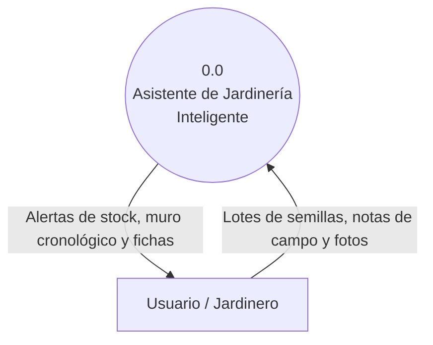

# Especificación de Requerimientos de Software (SRS)

## Proyecto: Asistente de Jardinería

## 1. Visión y alcance

### 1.1 Dominio y problema
En la jardinería, los cultivadores enfrentar desorganización en el seguimiento de sus cultivos o pérdida de insumos. Actualmente esto se resuelve de forma frangmentada mediante plantillas de cálculo, libretas de papel o la memoria, lo que puede provocar la pérdida de semillas por vencimiento y la falta de registros de técnicas que funcionaron en temporadas pasadas. 

### 1.2 Datos gestionados
* **Datos botánicos:** Fichas de especie, nombres científicos con reglas de formato (género en cursiva, variedad entre comillas simples), nombres comunes y familias.
* **Datos transaccionales de inventario:** Lotes de semillas, cantidades, mes y año de cosecha.
* **Bitácora:** Notas de campo en texto libre.

### 1.3 Usuarios y Stakeholders
**Stakeholders:**
1. Ingeniero Agrónomo
2. Técnicos en Jardineria
3. Público interesado

**Usuarios:**
* Roles:
1. Administrador
2. Usuario

### 1.4 Propuesta de valor
Transforma la gestión empírica en un proceso guiado y predecible. Permite la consulta instantánea de semillas viables y consolida el historial del jardin en una visión cronologica accesible.

### 1.5 Selección justificada del alcance para el MVP
* **Procesos seleccionados para desarrollar**
1. Control de semillas: Permite controlar el inventario.
2. Gestión de bitácora y observaciones: Permite realizar un seguimiento de las especies elegidas, añadiendo controles pregerminativos, tipos, enfermedades y plagas, entre otros.
* **Procesos descartados para iteracciones futuras:**
1. *Sincronización con Google Calendar API* y *Alertas Climáticas con Estación Meteorológica*. Se posponen por depender de APIs de terceros. Aislar estos componentes permite consolidar la arquitectura de datos propia y reducir riesgos técnicos.

### 1.6 Riesgo de fracaso y mitigación
**Riesgo identificado (módulo 1):** *Incertidumbre inicial y cambio de requerimientos sobre la bitácora o gestor de semillas*
**Estrategia de mitigación:** Adopción del ciclo de vida Iterativo e Incremental para entregar un MVP funcional temprano, validando la usabilidad y reglas de negocio con el usuario antes de desarrollar módulos avanzados.

### 1.7 Datos sensibles y ética profesional (Código IEEE/ACM)
En cumplimiento con el Código de Ética IEEE/ACM sobre la protección de la privacidad, las notas de campo y ubicaciones de cultivo pertenecen exclusivamente al ámbito privado del usuario. Se aplica *privacidad por diseño*, manteniendo las bitácoras aisladas y desacopladas del catálogo base compartido.

## 2. Diagramas de Contexto (DFD)

### 2.1 DFD Nivel 0

